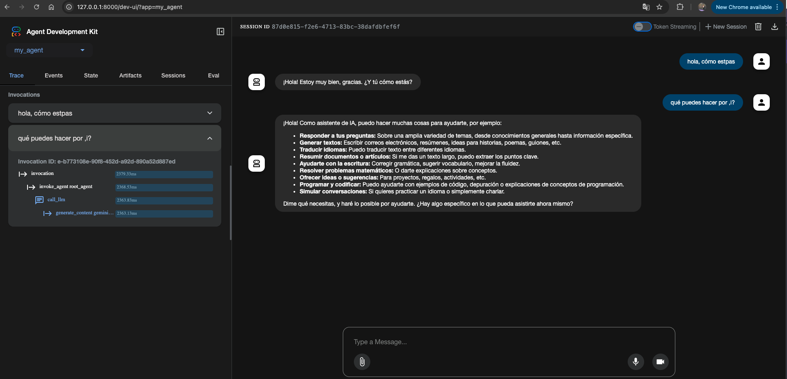

# ADK (Agent Development Kit) - Google

Guía para crear y desplegar agentes de IA usando el Agent Development Kit de Google.

## ¿Qué es el ADK?

Agent Development Kit es un kit diseñado para la creación e implemetación de agentes de ai de Google, este te permitirá el uso de LLM's open source y del ecosistema de google (Gemini).

### **Características**
* Orchestation : Creación de pipelines usando worflow de agentes (sequential agents, parallel agents and loop agents)
* Multiagente: Capaz de crear múltiples agentes y organizarlos jerarquicamente 
* Tools: Usabilidad de diversos tools integradas con API's o funciones adicionales
* Web-based: Integración de su propio entorno web al crear agentes
* Diseñado en diversos lenguajes como Python, Java, Go y TypeScript
* Interoperabilidad: Integración con otros frameworks de agentes
* Acepta protocolos como MCP y el propio que es A2A 
* ADK esta echo en contenedores, por lo que es fácil su despliegue 


## Requisitos

- Python 3.11 o superior
- [uv](https://docs.astral.sh/uv/) — gestor de paquetes y entornos para Python
- [ADK de Google](https://google.github.io/adk-docs/)
- [API Key de Gemini](https://aistudio.google.com/api-keys)

## Instalación y configuración

### 1. Crear la carpeta del proyecto
```bash
mkdir nombre_de_tu_carpeta
cd nombre_de_tu_carpeta
uv init
```

### 2. Crear el entorno virtual de Python y sincronizar los cambios que hagas con el venv
```bash
uv venv google-adk 
source adk/bin/activate
```

### 3. Instalar el ADK de Google
```bash
uv add google-adk
adk --version
```

### 4. Configurar variables de entorno

> ⚠️ No olvides agregar `.env` a tu `.gitignore` para no exponer tu clave.


## Uso

### Crear un agente a través de un template predeterminado
```bash
uv adk my_first_agent
```


### Ejecutar en interfaz web
```bash
uv run adk web
```

### Ejecutar en terminal
```bash
adk run my_agent
```

### Resultado



## Recursos

- [Documentación oficial de ADK](https://google.github.io/adk-docs/)
- [Google AI Studio](https://aistudio.google.com/)