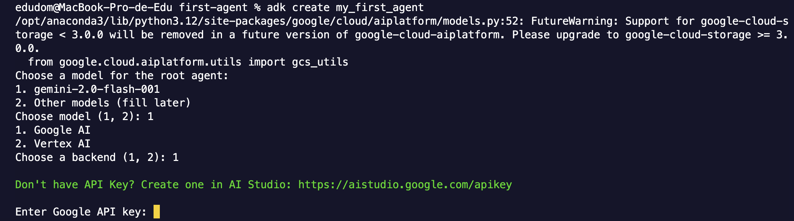
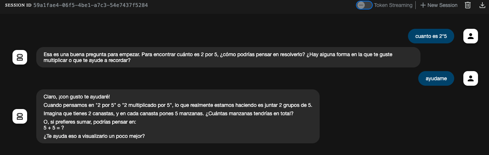
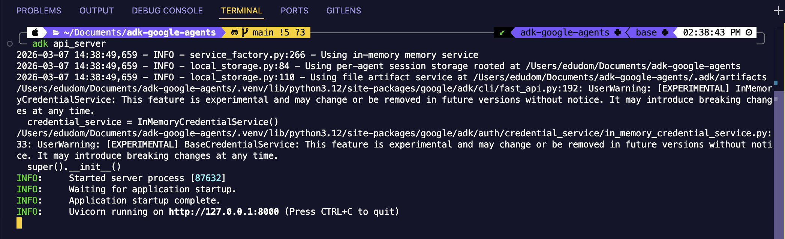
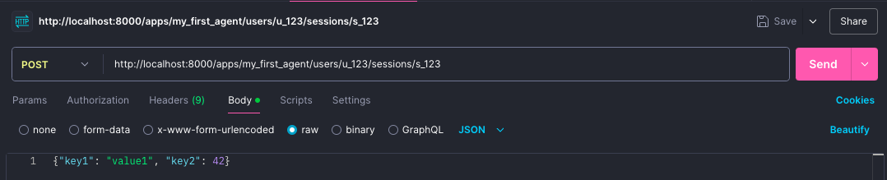
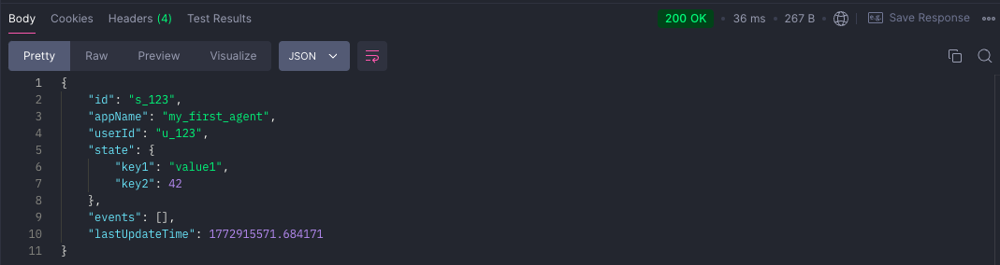

# ADK (Agent Development Kit) - Google

Guía para crear y desplegar agentes de IA usando el Agent Development Kit de Google.

## ¿Qué es el ADK?

Agent Development Kit es un kit diseñado para la creación e implemetación de agentes de ai de Google, este te permitirá el uso de LLM's open source y del ecosistema de google (Gemini).

### **Características**
* Orchestation : Creación de pipelines usando worflow de agentes (sequential agents, parallel agents and loop agents)
* Multiagente: Capaz de crear múltiples agentes y organizarlos jerarquicamente 
* Tools: Usabilidad de diversos tools integradas con API's o funciones adicionales
* Web-based: Integración de su propio entorno web al crear agentes
* Diseñado en diversos lenguajes como Python, Java, Go y TypeScript
* Interoperabilidad: Integración con otros frameworks de agentes
* Acepta protocolos como MCP y el propio que es A2A 
* ADK esta echo en contenedores, por lo que es fácil su despliegue 


## Requisitos

- Python 3.11 o superior
- [uv](https://docs.astral.sh/uv/) — gestor de paquetes y entornos para Python
- [ADK de Google](https://google.github.io/adk-docs/)
- [API Key de Gemini](https://aistudio.google.com/api-keys)
- [Postman](https://www.postman.com/) o [ApiDog](https://apidog.com/es/)

## Instalación y configuración

### 1. Crear la carpeta del proyecto
```bash
mkdir nombre_de_tu_carpeta
cd nombre_de_tu_carpeta
uv init
```

### 2. Crear el entorno virtual de Python y sincronizar los cambios que hagas con el venv
```bash
uv venv google-adk 
source adk/bin/activate
```

### 3. Instalar el ADK de Google
```bash
uv add google-adk
adk --version
```

### 4. Configurar variables de entorno

> ⚠️ No olvides agregar `.env` a tu `.gitignore` para no exponer tu clave.


## Uso

### Crear un agente a través de un template predeterminado
```bash
uv adk my_first_agent
```



### Ejecutar en interfaz web
```bash
uv run adk web
```

### Ejecutar en terminal
```bash
adk run my_agent
```

### Resultado


## Recursos

- [Documentación oficial de ADK](https://google.github.io/adk-docs/)
- [Google AI Studio](https://aistudio.google.com/)


# Componentes internos del ADK

<details>
<summary><strong>Agent.py 🤖</strong></summary>
Este archivo es nuestro agente, el cuál contendrá las características de instrucciones/comportamiento y las tools con las que se podrá conectar.

```python
from google.adk.agents.llm_agent import Agent

root_agent = Agent(
    model='gemini-2.5-flash', #modelo a usar
    name='root_agent', #nombre del agente usado por el ADK internamente
    description='A helpful assistant for user questions.', #Summary de lo que el agente hace
    instruction='Answer user questions to the best of your knowledge', #comportamiento que guía cómo actúa y responde su agente
)
```

### Description


Otros agents leerían esto para decidir si es necesario delegar alguna tarea con este agent

**Ejemplo: Maneja consultas de facturación de clientes y procesamiento de pagos.**

* Utilizado por otros agentes para decidir si deben enrutar tareas a este agente
* Ayuda en sistemas multiagente donde los agentes delegan entre sí.
* No utilizado por el propio agente para su propio comportamiento

### Instruction

Esto podemos definir que es unicamente para el **comportamiento** del agente

**Ejemplo: Eres un contador especializado, atenton, empático que usara esta herramienta {nombre_del_tool} para checar los detalles de las cuentas, nunca tienes que decir groserias,etc**

* Definimos la personalidad del agente, así como su forma de comunicación
* Establece límites y restricciones sobre el comportamiento 
* Guía cuándo y cómo usar las herramientas 
* Da forma al formato de salida


Ejemplo:
```python
billing_agent = Agent(
    model='gemini-2.5-flash',
    name='billing_agent',
    # OTROS agentes leen esto para decidir si deben delegar aquí
    description='Maneja las consultas de facturación de los clientes y el procesamiento de pagos',
    # ESTE agente lee esto para saber cómo comportarse
    instruction="""Eres un especialista en facturación.

    Al ayudar a los clientes:
    1. Sé empático y paciente
    2. Explica los cargos claramente
    3. Usa la herramienta billing_lookup para verificar los detalles de la cuenta
    4. Nunca prometas reembolsos sin la aprobación del gerente

    Mantén siempre un tono profesional y servicial."""
)

support_agent = Agent(
    model='gemini-2.5-flash',
    name='support_agent',
    description='Maneja preguntas generales de atención al cliente',
    instruction="""Eres un agente de atención al cliente.

    Si una pregunta es sobre facturación, transfiérela al billing_agent.
    De lo contrario, ayuda al cliente directamente."""
)
```

Asigne siempre su agente principal a una variable denominada "root_agent"


Ejemplo de comportamiento bajo las siguientes características:

``` python
description='A helpful assistant for user questions.',
instruction='Answer user questions to the best of your knowledge',
```



[Accede el archivo para ver distintas formas de comportamiento del agente 🤓☝️](https://github.com/EduDN/adk-google-agents/blob/main/my_first_agent/agent.py)

</details>

<details><summary><strong>Formas de ejecutar/consumir tu Agente 🤖</strong></summary>


### Terminal

``` bash
adk run carpeta_donde_esta_tu_agente
```

``` bash
adk run my_first_agent
```

### Versión Web
``` bash
adk web
```

<details>
<summary><strong>Api's</strong></summary>
Levantaremos un local web server

**Debe ser ejecutado desde la carpeta padre (adk-google-agents)**
``` bash
adk api_server
```


Con el uso de Postman, haremos peticiones a nuestro local server

Crearemos primero una **sesión y un usario** que estarán consumiendo nuestras peticiones.


``` bash
http://localhost:8000/apps/my_first_agent/users/u_123/sessions/s_123
```

* my_first_agent = Carpeta en donde se encuentra alojado tu agente

* u_123 = nombre de usuario que estás generando

* s_123 = número de sesión que estás generando

* {"key1": "value1", "key2": 42} = valores que están enviando

 

**Resultado esperado**



**Send a Query**

Basándonos en la sesión y usuario que creamos anteriomente se hará un query

``` bash
http://localhost:8000/run
``` 


```bash
{
  "appName": "my_first_agent",
  "userId": "u_123",
  "sessionId": "s_123",
  "newMessage": {
    "role": "user",
    "parts": [{
      "text": "Hola"
    }]
  }
}
``` 

**Resultado Esperado**


**Send a Query with Server-Sent-Events**

A diferencia de la anterior forma de ejecutar queries, el Server Sent Events nos permite regresar tokens en tiempo real, por lo que veremos diversos outputs en nuestro JSON, debido a que llegan en tiempo real.


```bash
http://localhost:8000/run_sse
```

```bash
{
"appName": "my_first_agent",
"userId": "u_123",
"sessionId": "s_123",
"newMessage": {
    "role": "user",
    "parts": [{
    "text": "Cuánto es 2+1+(5*4) y qué se resuelve primero en la operación?"
    }]
},
"streaming": true
}
```


[Documentación de ApiServer ADK](https://google.github.io/adk-docs/runtime/api-server/)

</details>


</details>
